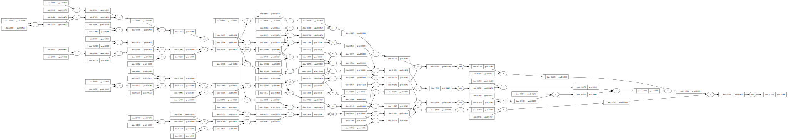

# Foundation

An autograd engine for scalar values inspired by the [videos](https://youtu.be/VMj-3S1tku0) of A. Karpathy.

## Example Usage

```python
# input
xs = [
    [2.0, 3.0, -1.0],
    [3.0, -1.0, 0.5],
    [0.5, 1.0, 1.0],
    [1.0, 1.0, -1.0]
]

# labels aka desired targets
ys = [1.0, -1.0, -1.0, 1.0]

# multi-layer perceptron with 3 inputs, 3 layers with 4, 4 and 1 neurons
model = MLP(no_inputs=3, no_layer_outputs=[4, 4, 1])
model.summary()
```

Output:

```bash
===== Model Summary =====
1. Dense Layer of 4 Tanh-Neurons: 16 params
2. Dense Layer of 4 Tanh-Neurons: 20 params
3. Dense Layer of 1 Tanh-Neurons: 5 params
=========================
Total trainable parameters: 41
```

### Training

```python
history = model.fit(x=xs, y=ys, lr=0.05, epochs=100)
```

History:
```bash
epoch 0 loss: 2.620456417661833
epoch 1 loss: 2.5213582195836794
epoch 2 loss: 2.4216506453173956
epoch 3 loss: 2.3188650154871064
...
epoch 97 loss: 0.04385590905419104
epoch 98 loss: 0.043261094071933195
epoch 99 loss: 0.042681385481372854
```

### Inference
```
predictions = [model(x) for x in xs]
```

Predictions:

```
[[Scalar(data=0.976647742913969)],
 [Scalar(data=-0.9602787258916622)],
 [Scalar(data=-0.9465864640697536)],
 [Scalar(data=0.9442682694431568)]]
```

Model Graph:
```python
draw_graph(predictions)
```

